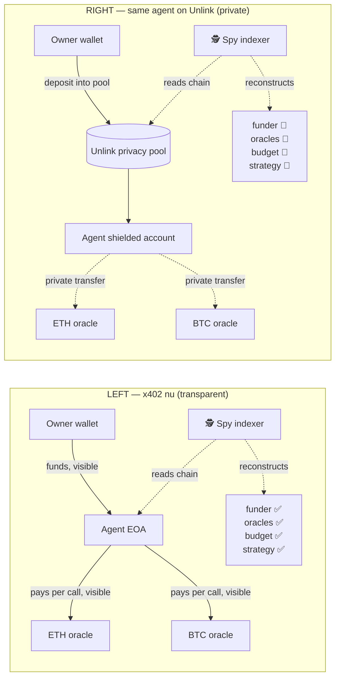
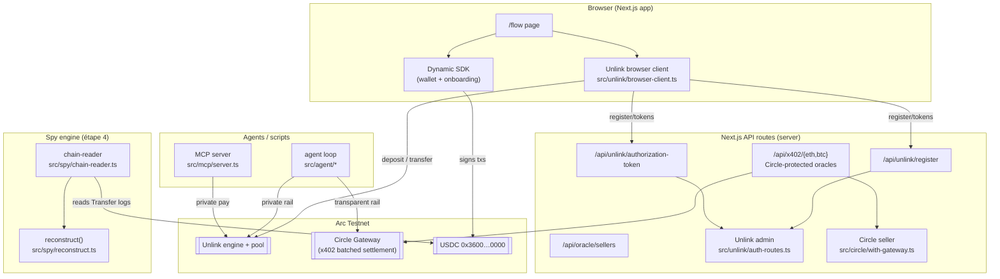
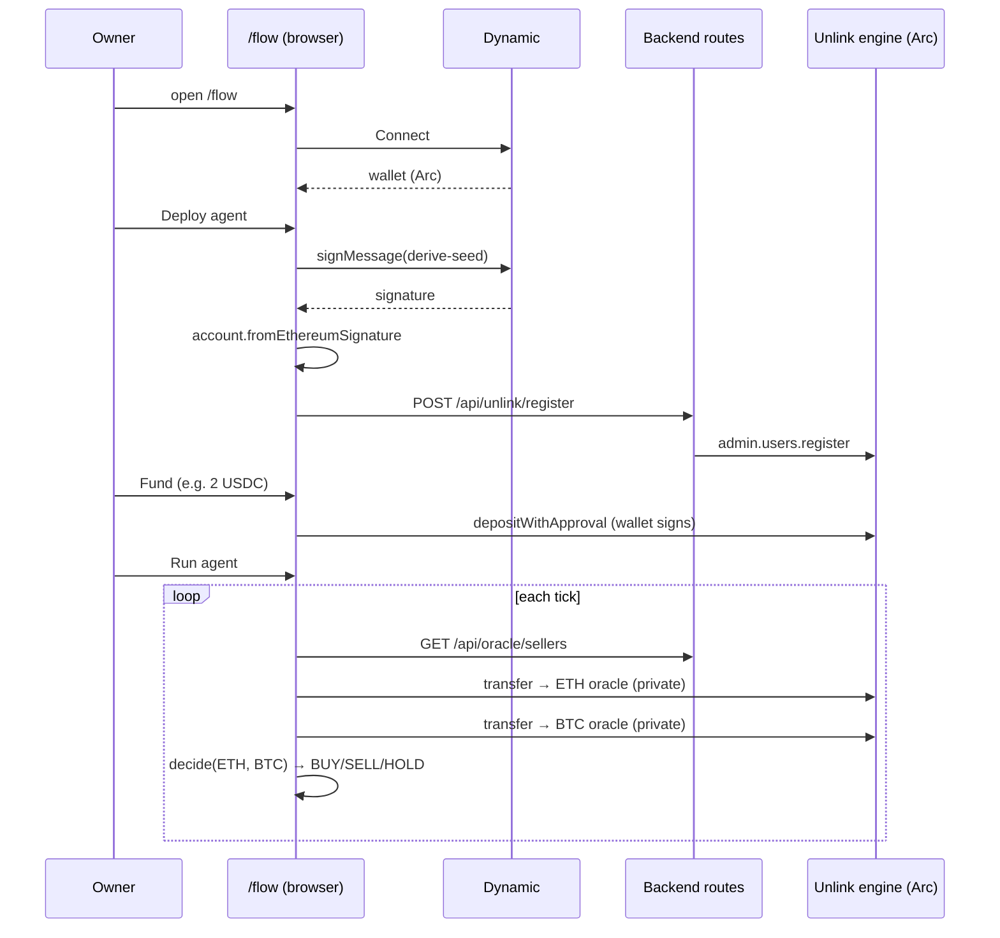
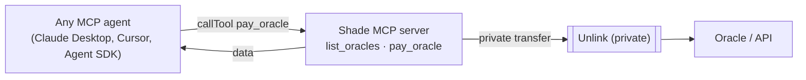

# Shade — Architecture

> Private nano-payment agent. An agent's **funding** (by its owner) and **spending**
> (per API call) are unreadable on-chain — where bare x402 exposes the agent's
> strategy, budget and funder to anyone reading the chain.
>
> Combines the three required SDKs: **Dynamic** (onboarding/wallet) · **Unlink**
> (private accounts) · **Circle Nanopayments** (x402 settlement). Runs on **Arc Testnet**.

---

## 1. The thesis in one picture

The same agent does the same thing on two rails. The only difference is **what a
competitor reading the chain can reconstruct**.

The visual contrast **is** the pitch (the split-screen demo, étape 4).

---

## 2. System components

---

## 3. Owner flow (sequence)

---

## 4. SDK mapping (by necessity, not box-ticking)

| Step | SDK | Call |
|------|-----|------|
| Owner onboarding + wallet | **Dynamic** | embedded wallet, signs |
| Derive agent's private identity | **Unlink** | `account.fromEthereumSignature` |
| Budget → private agent account | **Unlink** | `depositWithApproval()` |
| Agent pays each oracle (private rail) | **Unlink** | `transfer()` |
| Settlement / transparent rail | **Circle Nanopayments** | x402 v2 + EIP-3009 (`GatewayClient` / `BatchFacilitatorClient`) |
| Withdraw | **Unlink** | `withdraw()` |
| Plug in any external agent | **MCP** | `pay_oracle` tool → Unlink |

---

## 5. "Plug in your agent" (MCP)

- **Demo**: shared budget — any agent plugs in with zero config.
- **Prod**: per-user — the user funds their own Unlink account (auth layer).

---

## 6. Networks & assets

- **Chain**: Arc Testnet (`eip155:5042002`), gas paid in USDC. Base Sepolia kept as a
  configurable fallback (`UNLINK_ENVIRONMENT`).
- **Asset**: USDC `0x3600000000000000000000000000000000000000` — one asset for both rails.
- **Circle facilitator**: `https://gateway-api-testnet.circle.com` (testnet).

## 7. What's judged vs out of scope

- **Judged**: the *private payment* for agent data (Unlink + Circle + Dynamic combined).
- **Out of scope (YAGNI)**: real DEX execution, smart-contract-enforced allowance
  (shown in UI only), multi-agent, prod auth for per-user MCP.
